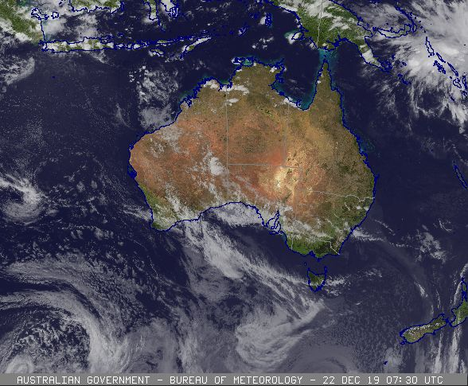

<!DOCTYPE html>
<html lang="en">
<head>
<title>Christoph's Website</title>
</head>
<body style="background-color:darkgrey" align="center">
  <h1 style="font-family:Helvetica">Today's Wx Synopsis</h1>
  
This section will have written weather synopsis.

  <h2 style="font-family:Helvetica;font-size:20pt" > Today's Satelltite</h2>
  
  <h2 style="font-family: Helvetica; font-size:20pt">Today's Topo</h2>
  

  <h2 style="font-family:Helvetica;font-size:20pt"> Useful Links </h2>
  

    <a href="https://www.wikipedia.org" style="font-family: Arial"> Wikipedia </a>
    
<a href="http://www.bom.gov.au/aviation/" style="font-family: Arial"> BOM Aviation </a>

    
<a href="http://www.bom.gov.au/nsw/forecasts/sydney.shtml" style="font-family: Arial"> BOM SYD </a>

  

</body>
</html>
